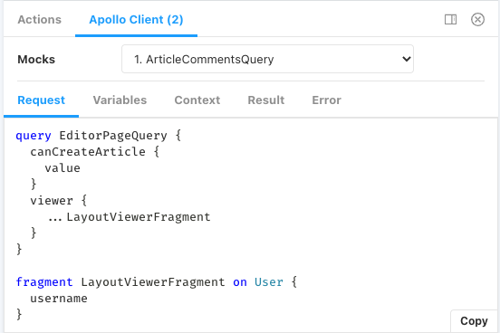

# Storybook Addon Apollo Client

Use Apollo Client in your Storybook stories.

## Versions

- If you're using Apollo Client 2.x and Storybook 5.x use version 1.x
- If you're using Apollo Client 2.x or 3.x and Storybook 6.x use version 4.x
- If you're using Apollo Client 2.x or 3.x and Storybook 7.x use version 5.x
- If you're using Apollo Client 2.x or 3.x and Storybook 8.x use version 7.x
- If you're using Apollo Client 3.x and Storybook 8.3+ use version 8.x
- If you're using Apollo Client 3.x and Storybook 9+ use version 9.x
- If you're using Apollo Client 3.x or 4.x and Storybook 10+ use version 10.x

## Install

**pnpm**

```shell
pnpm add -D storybook-addon-apollo-client
```

**yarn**

```shell
yarn add -D storybook-addon-apollo-client
```

**npm**

```shell
npm install -D storybook-addon-apollo-client
```

Add the addon to your configuration in `.storybook/main.ts`

```js
export default {
  ...config,
  addons: [
    ...yourAddons
    "storybook-addon-apollo-client",
  ],
};
```

## Setup for version 10.x

To enable the addon panel to display GraphQL queries and responses, you need to set up a decorator in your `.storybook/preview.ts` (or `.tsx`) file. The decorator listens to the `apolloClient` parameters and communicates with the addon panel.

### React Setup

#### Apollo Client v3

For React projects using `MockedProvider` with Apollo Client v3:

```tsx
import type { MockedResponse } from '@apollo/client/testing';
import { MockedProvider } from '@apollo/client/testing';
import { addons } from 'storybook/internal/preview-api';
import type { Preview } from '@storybook/react';
import { print } from 'graphql';
import { useEffect } from 'react';
import type { ApolloClientAddonState } from 'storybook-addon-apollo-client';
import { EVENTS } from 'storybook-addon-apollo-client';

const getMockName = (mockedResponse: MockedResponse) => {
  if (mockedResponse.request.operationName) {
    return mockedResponse.request.operationName;
  }

  const operationDefinition = mockedResponse.request.query.definitions.find(
    (definition) => definition.kind === 'OperationDefinition',
  );

  if (operationDefinition?.name) {
    return operationDefinition.name.value;
  }

  return `Unnamed`;
};

function stringifyOrUndefined(value: unknown) {
  try {
    return JSON.stringify(value, null, 2);
  } catch {
    return undefined;
  }
}

function createResultFromMocks(mocks: MockedResponse[], activeIndex: number): ApolloClientAddonState {
  const mock = mocks[activeIndex];
  if (!mock) {
    return {
      activeIndex: -1,
      options: mocks.map(getMockName),
      query: undefined,
      variables: undefined,
      extensions: undefined,
      context: undefined,
      result: undefined,
      error: undefined,
    };
  }
  return {
    options: mocks.map(getMockName),
    activeIndex: activeIndex,
    query: print(mock.request.query),
    variables: stringifyOrUndefined(mock.request.variables),
    extensions: stringifyOrUndefined(mock.request.extensions),
    context: stringifyOrUndefined(mock.request.context),
    result: stringifyOrUndefined(mock.result),
    error: stringifyOrUndefined(mock.error),
  };
}

const preview: Preview = {
  decorators: [
    (Story, context) => {
      useEffect(() => {
        const { mocks = [] } = context.parameters.apolloClient || {};
        const channel = addons.getChannel();

        const handleRequest = (activeIndex: number) => {
          const state = createResultFromMocks(mocks, activeIndex);
          channel.emit(EVENTS.RESULT, state);
        };

        // Emit initial state
        handleRequest(mocks.length ? 0 : -1);

        channel.on(EVENTS.REQUEST, handleRequest);

        return () => {
          channel.off(EVENTS.REQUEST, handleRequest);
        };
      }, [context.parameters.apolloClient]);

      if (!context.parameters.apolloClient) {
        return <Story />;
      }

      return (
        <MockedProvider {...context.parameters.apolloClient}>
          <Story />
        </MockedProvider>
      );
    },
  ],
};

export default preview;
```

#### Apollo Client v4

For React projects using `MockedProvider` with Apollo Client v4:

```tsx
import { MockLink } from '@apollo/client/testing';
import { MockedProvider } from '@apollo/client/testing/react';
import { addons } from 'storybook/internal/preview-api';
import type { Preview } from '@storybook/react';
import { print } from 'graphql';
import React, { useEffect } from 'react';
import type { ApolloClientAddonState } from 'storybook-addon-apollo-client';
import { EVENTS } from 'storybook-addon-apollo-client';

const getMockName = (mockedResponse: MockLink.MockedResponse) => {
  const operationDefinition = mockedResponse.request.query.definitions.find(
    (definition) => definition.kind === 'OperationDefinition',
  );

  if (operationDefinition?.name) {
    return operationDefinition.name.value;
  }

  return `Unnamed`;
};

function stringifyOrUndefined(value: unknown) {
  try {
    return JSON.stringify(value, null, 2);
  } catch {
    return undefined;
  }
}

function createResultFromMocks(mocks: MockLink.MockedResponse[], activeIndex: number): ApolloClientAddonState {
  const mock = mocks[activeIndex];
  if (!mock) {
    return {
      activeIndex: -1,
      options: mocks.map(getMockName),
      query: undefined,
      variables: undefined,
      extensions: undefined,
      context: undefined,
      result: undefined,
      error: undefined,
    };
  }
  return {
    options: mocks.map(getMockName),
    activeIndex: activeIndex,
    query: print(mock.request.query),
    variables: stringifyOrUndefined(mock.request.variables),
    extensions: undefined,
    context: undefined,
    result: stringifyOrUndefined(mock.result),
    error: String(mock.error),
  };
}

const preview: Preview = {
  decorators: [
    (Story, context) => {
      useEffect(() => {
        const { mocks = [] } = context.parameters.apolloClient || {};
        const channel = addons.getChannel();

        const handleRequest = (activeIndex: number) => {
          const state = createResultFromMocks(mocks, activeIndex);
          channel.emit(EVENTS.RESULT, state);
        };

        // Emit initial state
        handleRequest(-1);

        channel.on(EVENTS.REQUEST, handleRequest);

        return () => {
          channel.off(EVENTS.REQUEST, handleRequest);
        };

      }, [context.parameters.apolloClient]);

      if (!context.parameters.apolloClient) {
        return <Story />;
      }

      return (
        <MockedProvider {...context.parameters.apolloClient}>
          <Story />
        </MockedProvider>
      );
    },
  ],
};

export default preview;
```

### Vue Setup

For Vue 3 projects using `@vue/apollo-composable`:

```ts
import type { Preview } from '@storybook/vue3';
import type { MockedResponse } from '@apollo/client/testing';
import { MockLink } from '@apollo/client/testing';
import { ApolloClient, InMemoryCache } from '@apollo/client/core';
import { provideApolloClient } from '@vue/apollo-composable';
import { addons } from 'storybook/internal/preview-api';
import type { ApolloClientAddonState } from 'storybook-addon-apollo-client';
import { EVENTS } from 'storybook-addon-apollo-client';
import { print } from 'graphql';
import { h, onMounted, onUnmounted } from 'vue';

const getMockName = (mockedResponse: MockedResponse) => {
  if (mockedResponse.request.operationName) {
    return mockedResponse.request.operationName;
  }

  const operationDefinition = mockedResponse.request.query.definitions.find(
    (definition) => definition.kind === 'OperationDefinition',
  );

  if (operationDefinition?.name) {
    return operationDefinition.name.value;
  }

  return `Unnamed`;
};

function stringifyOrUndefined(value: unknown) {
  try {
    return JSON.stringify(value, null, 2);
  } catch {
    return undefined;
  }
}

function createResultFromMocks(mocks: MockedResponse[], activeIndex: number): ApolloClientAddonState {
  const mock = mocks[activeIndex];
  if (!mock) {
    return {
      activeIndex: -1,
      options: mocks.map(getMockName),
      query: undefined,
      variables: undefined,
      extensions: undefined,
      context: undefined,
      result: undefined,
      error: undefined,
    };
  }
  return {
    options: mocks.map(getMockName),
    activeIndex: activeIndex,
    query: print(mock.request.query),
    variables: stringifyOrUndefined(mock.request.variables),
    extensions: stringifyOrUndefined(mock.request.extensions),
    context: stringifyOrUndefined(mock.request.context),
    result: stringifyOrUndefined(mock.result),
    error: stringifyOrUndefined(mock.error),
  };
}

const preview: Preview = {
  decorators: [
    (story, context) => {
      const { mocks = [] } = context.parameters.apolloClient || {};

      const mockLink = new MockLink(mocks);

      const client = new ApolloClient({
        cache: new InMemoryCache(),
        link: mockLink,
      });

      return {
        setup() {
          provideApolloClient(client);

          onMounted(() => {
            const channel = addons.getChannel();

            const handleRequest = (activeIndex: number) => {
              const state = createResultFromMocks(mocks, activeIndex);
              channel.emit(EVENTS.RESULT, state);
            };

            // Emit initial state
            handleRequest(mocks.length ? 0 : -1);

            channel.on(EVENTS.REQUEST, handleRequest);

            onUnmounted(() => {
              channel.off(EVENTS.REQUEST, handleRequest);
            });
          });

          return () => h(story());
        },
      };
    },
  ],
};

export default preview;
```

## 7.0 Features

- removed `globalMocks` key to favor composition

### Migrate from 5.x+ to 7.x

#### Example of < 7.x

**preview.ts**

```js
import { MockedProvider } from '@apollo/client/testing'; // Use for Apollo Version 3+
// import { MockedProvider } from "@apollo/react-testing"; // Use for Apollo Version < 3

export const preview = {
  parameters: {
    apolloClient: {
      MockedProvider,
      globalMocks: [
        // whatever mocks you want here
      ],
    },
  },
};
```

#### Example of 7.x

**preview.ts**

```js
// Whatever you want here, but not Apollo Client related
```

**component.stories.ts**

```ts
import type { Meta } from '@storybook/react';
import { globalMocks } from './globalMocks';
import { otherMocks } from './otherMocks';
import { YourComponent, YOUR_QUERY } from './component';

export const meta: Meta<typeof DisplayLocation> = {
  component: YourComponent,
  parameters: {
    apolloClient: {
      mocks: [
        ...globalMocks,
        ...otherMocks,
        {
          request: {
            query: YOUR_QUERY,
          },
          result: {
            data: {
              // your data here
            },
          },
        },
      ],
    },
  },
};
```

## Upgrading from a previous version below 6.x

In previous versions, we had a decorator called `withApolloClient` this is no longer nesscessary. If you're upgrading from this API here are the following changes that you'll need to make:

1. remove all code referencing the deprecated withApolloClient decorator.
2. follow install instructions

## Writing your stories with queries

```jsx
import DashboardPage, { DashboardPageQuery } from '.';

export default {
  title: 'My Story',
};

export const Example = () => <DashboardPage />;

Example.parameters = {
  apolloClient: {
    mocks: [
      {
        request: {
          query: DashboardPageQuery,
        },
        result: {
          data: {
            viewer: null,
          },
        },
      },
    ],
  },
};
```

Read more about the options available for MockedProvider at https://www.apollographql.com/docs/react/development-testing/testing

### Usage

In Storybook, click "Show Addons" and navigate to the "Apollo Client" tab.



## Example App

To see real world usage of how to use this addon, check out the example app:

https://github.com/lifeiscontent/realworld

## Loading State

You can use the `delay` parameter to simulate loading state.

```js
import DashboardPage, { DashboardPageQuery } from '.';

export default {
  title: 'My Story',
};

export const Example = () => <DashboardPage />;

Example.parameters = {
  apolloClient: {
    mocks: [
      {
        // Use `delay` parameter to increase loading time
        delay: 1000,
        request: {
          query: DashboardPageQuery,
        },
        result: {
          data: {},
        },
      },
    ],
  },
};
```

## Error State

You can use the `error` parameter to create error state.

```js
import DashboardPage, { DashboardPageQuery } from '.';

export default {
  title: 'My Story',
};

export const Example = () => <DashboardPage />;

Example.parameters = {
  apolloClient: {
    mocks: [
      {
        request: {
          query: DashboardPageQuery,
        },
        error: new ApolloError('This is a mock network error'),
      },
    ],
  },
};
```
