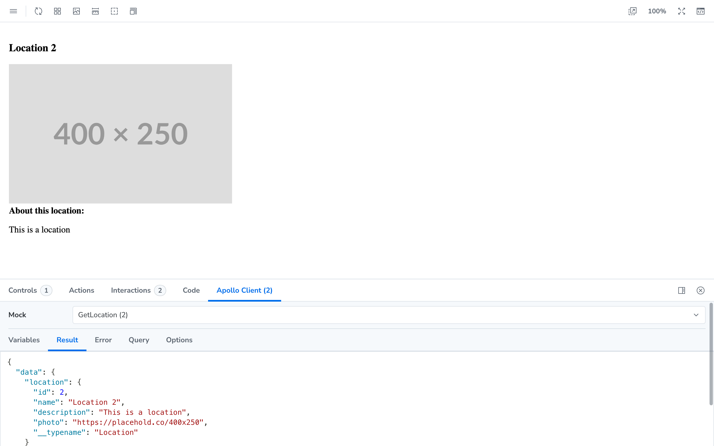

# Storybook Addon Apollo Client

Use Apollo Client in your Storybook stories.

## Versions

- If you're using Apollo Client 2.x and Storybook 5.x use version 1.x
- If you're using Apollo Client 2.x or 3.x and Storybook 6.x use version 4.x
- If you're using Apollo Client 2.x or 3.x and Storybook 7.x use version 5.x
- If you're using Apollo Client 2.x or 3.x and Storybook 8.x use version 7.x
- If you're using Apollo Client 3.x and Storybook 8.3+ use version 8.x
- If you're using Apollo Client 3.x and Storybook 9+ use version 9.x
- If you're using Apollo Client 3.x or 4.x and Storybook 10+ use version 10.x
- If you're using Apollo Client 3.x or 4.x and Storybook 11+ use version 11.x

## Install

**pnpm**

```shell
pnpm add -D storybook-addon-apollo-client
```

**yarn**

```shell
yarn add -D storybook-addon-apollo-client
```

**npm**

```shell
npm install -D storybook-addon-apollo-client
```

Add the addon to `.storybook/main.ts`. This adds the Apollo Client panel.

```ts
import { defineMain } from '@storybook/react-vite/node';

export default defineMain({
  // ...rest of config
  addons: ['storybook-addon-apollo-client'],
});
```

## Setup

Register the addon in `.storybook/preview.ts`. Give it the Apollo Client part that your framework uses. The addon then:

- gives each story that has an `apolloClient` parameter a mocked Apollo Client
- sends the mocks of the current story to the Apollo Client panel
- types the `apolloClient` parameter from the part that you give it

Because the type comes from your own Apollo Client code, it agrees with your Apollo Client version.

### React

Give the addon the `MockedProvider` from your Apollo Client version. The `apolloClient` parameter gets the props of that `MockedProvider`. For example, `addTypename` is a type error with Apollo Client 4, because Apollo Client 4 removed it.

```ts
import { definePreview } from '@storybook/react-vite';
// Apollo Client 4
import { MockedProvider } from '@apollo/client/testing/react';
// Apollo Client 3
// import { MockedProvider } from '@apollo/client/testing';
import apolloClient from 'storybook-addon-apollo-client';

export default definePreview({
  // ...rest of preview
  addons: [apolloClient({ MockedProvider })],
});
```

### Other renderers

For other renderers, for example Vue or Svelte, use the `/core` entry. It connects the panel and types the `apolloClient` parameter, but you supply the Apollo Client in your own decorator. Give the type of the parameter as a type argument.

```ts
import type { MockLink } from '@apollo/client/testing';
import apolloClient from 'storybook-addon-apollo-client/core';

export default definePreview({
  addons: [apolloClient<{ mocks?: MockLink.MockedResponse[] }>()],
  decorators: [
    // Your decorator: make a client from context.parameters.apolloClient.mocks and give it to the story.
  ],
});
```

## Writing your stories with queries

```ts
import preview from '../.storybook/preview';
import { DashboardPage, DashboardPageQuery } from './DashboardPage';

const meta = preview.meta({
  component: DashboardPage,
});

export const Example = meta.story({
  parameters: {
    apolloClient: {
      mocks: [
        {
          request: {
            query: DashboardPageQuery,
          },
          result: {
            data: {
              viewer: null,
            },
          },
        },
      ],
    },
  },
});
```

Read more about the options available for MockedProvider at https://www.apollographql.com/docs/react/development-testing/testing

### Usage

In Storybook, open the addon panel and select the "Apollo Client" tab. Select a mock to see its query, variables, result, error, extensions, and context.



## Loading State

Use the `delay` property to show the loading state.

```ts
export const Loading = meta.story({
  parameters: {
    apolloClient: {
      mocks: [
        {
          // The response comes after 1000 ms
          delay: 1000,
          request: {
            query: DashboardPageQuery,
          },
          result: {
            data: {},
          },
        },
      ],
    },
  },
});
```

## Error State

Use the `error` property to show the error state.

```ts
export const Failure = meta.story({
  parameters: {
    apolloClient: {
      mocks: [
        {
          request: {
            query: DashboardPageQuery,
          },
          error: new Error('This is a mock network error'),
        },
      ],
    },
  },
});
```

## Without `definePreview`

If your `preview.ts` does not use `definePreview`, Storybook loads the panel decorator from `main.ts` automatically. Add the provider decorator yourself. For React, use `withMockedProvider`. The `apolloClient` parameter is not typed in this setup.

```ts
import type { Preview } from '@storybook/react-vite';
import { MockedProvider } from '@apollo/client/testing/react';
import { withMockedProvider } from 'storybook-addon-apollo-client';

const preview: Preview = {
  decorators: [withMockedProvider(MockedProvider)],
};

export default preview;
```

## Migrate from 10.x to 11.x

1. Update to Storybook 11.
2. Remove the Apollo Client decorator and its helper functions from `.storybook/preview.ts`. The addon supplies them now.
3. Add the addon to `addons` in `definePreview`, as shown in [Setup](#setup).
4. Fix the type errors that this shows in your `apolloClient` parameters.

## Example App

To see real world usage of how to use this addon, check out the example app:

https://github.com/lifeiscontent/realworld
